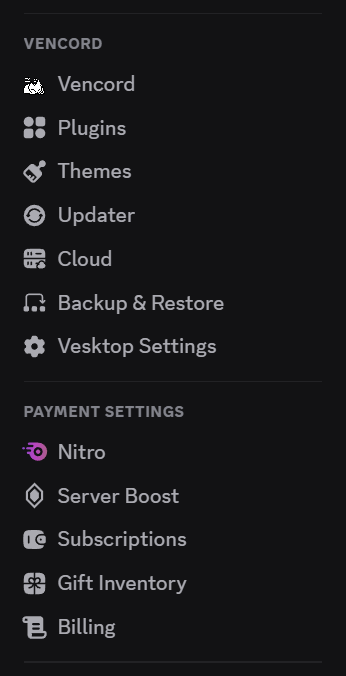
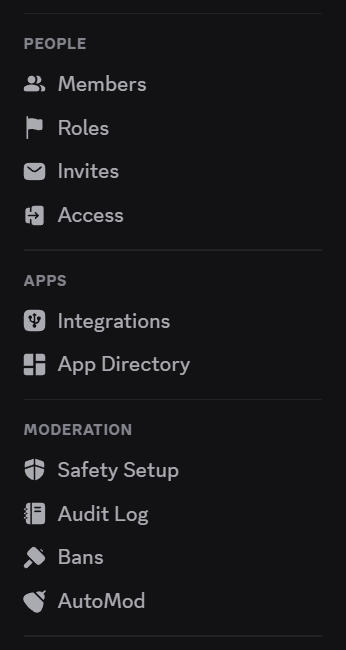
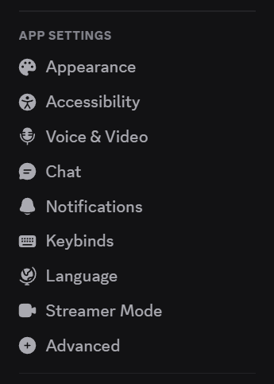
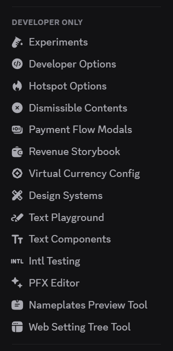

# SettingsIcons
Adds icons to settings for Vencord.

You will need the [ThemeAttributes](https://github.com/Vendicated/Vencord/tree/main/src/plugins/themeAttributes) plugin for this theme to function.

|  |  |  |  |
| -------------------------------------------------------------------- | ------------------------------------------------ | ------------------------------------------ | ---------------------------------------------------------------- |
| Vencord & payment settings                                           | Server settings                                  | App settings                               | Developer only settings                                          |
## Installation
### Local

1. Download [SettingsIcons.theme.css](https://github.com/924e50c0/SettingsIcons/releases/download/v0.0.1/SettingsIcons.theme.css).

2. Place the file in the themes folder:

   - `Settings` > `Vencord` > `Themes` > `Local Themes` > `Open Themes Folder`

3. Click `Load missing Themes` and toggle on the theme card.

### Online

1. Paste the link in `Settings` > `Vencord` > `Themes` > `Online Themes`:
   - `https://raw.githubusercontent.com/924e50c0/SettingsIcons/main/SettginsIcons.theme.css`

## Credits
- [Solar Icons](https://github.com/480-Design/Solar-Icon-Set)
- [Google Material Symbols](https://github.com/google/material-design-icons)
- [Vencord](https://github.com/Vendicated/Vencord)
